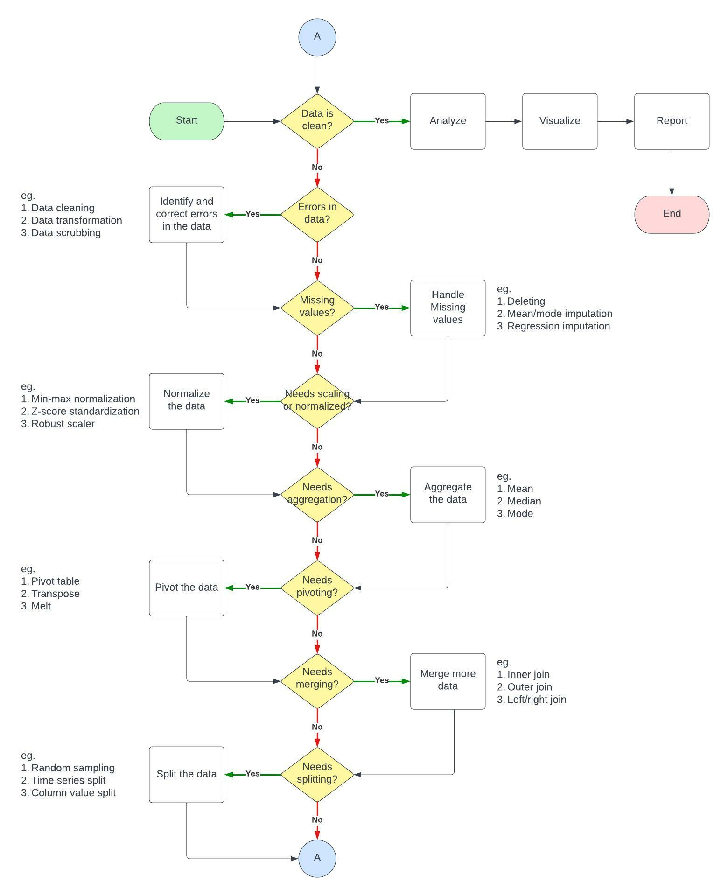

Student: 2022579 Mark Christian Albinto

Lecturer: Dr. Muhammad Iqbal

Date: 06 January 2023 10:00 - 07 January 2023 10:00

---

Clear all environment variables for new project

```{r}
rm(list = ls())
```


# Assessment Tasks

### Question 1

Create the table/dataframe for question 1 (Table 2.1)

```{r}
table_21_customer_id <- c(1001, 1002, 1003, 1004, 1005)
table_21_zip <- c(10048, 'J2S7K7', 90210, 6269, 55101)
table_21_gender <- c('M', 'F', NA, 'M', 'F')
table_21_income <- c(78000, -40000, 10000000, 50000, 99999)
table_21_age <- c('C', 40, 45, 0, 30)
table_21_marital_status <- c('M', 'W', 'S', 'S', 'D')
table_21_transaction_amount <- c(5000, 4000, 7000, 1000, 3000)

df_table_21 <- data.frame(table_21_customer_id, table_21_zip, table_21_gender, table_21_income, table_21_age, table_21_marital_status, table_21_transaction_amount)

table21_column_names <- c('Customer_ID', 'Zip', 'Gender', 'Income', 'Age', 'Marital_Status', 'Transaction_Amount')
colnames(df_table_21) <- table21_column_names

df_table_21
```

Take a look at the structure of the dataframe

```{r}
str(df_table_21)
```

#### a) Refer to the income attribute of the five customers in Table 2.1, before pre-processing.

##### a:i)	Find the mean income before pre-processing.

```{r}
table_21_income_mean <- mean(df_table_21$Income)

table_21_income_mean
```

##### a:ii) What does this number actually mean?

The value represents the "average" of the values in the dataset, but it may not be representative of the majority of the values. This is because the mean is sensitive to outliers, or values that are significantly higher or lower than the majority of the values in the dataset. In this case, the value of 10,000,000 is an outlier that is pulling the mean up significantly.

```{r}
barplot(df_table_21$Income)
abline(h = table_21_income_mean)
```

##### a:iii) Now, calculate the mean income for the three values left after pre-processing. Does this value have a meaning?

In the case of the values in Income, it is likely that the values -40000 and 10000000 are considered outliers because they are much smaller and much larger, respectively, than the other values in the list. These extreme values could potentially skew the results of statistical analyses, such as mean and median calculations, and may not be representative of the underlying data.

By removing these outliers, you can obtain a more accurate and representative view of the data.

```{r}
df_table_21_income_processed <- df_table_21$Income[c(1, 4, 5)]

df_table_21_income_processed_mean <- mean(df_table_21_income_processed)

df_table_21_income_processed_mean
```

```{r}
barplot(df_table_21_income_processed)
abline(h = df_table_21_income_processed_mean)
```

The new mean does have value because it provides a new summary statistic for the data. However, it is important to consider how the removal of the outliers has affected the mean and whether or not the new mean is representative of the underlying data. Removing outliers can change the mean and may result in a different interpretation of the data. It is important to carefully consider whether or not to remove outliers, as they may contain important information and may not always be the result of measurement errors or other anomalies.

#### b) Explain why zip codes should be considered text variables rather than numeric.

Zip codes should be considered text variables rather than numeric variables because they do not have a natural ordering. For example, the zip code "90210" is not greater than or less than the zip code "10001". Therefore, it doesn't make sense to perform mathematical operations like addition or subtraction on zip codes.

In addition, zip codes may contain leading zeros, which can be lost when they are treated as numeric variables. For example, the zip code "00210" would be stored as 210 if it were treated as a numeric variable, but this would lose important information.

In general, it is a good idea to treat variables that represent categorical data, such as zip codes, as text variables rather than numeric variables. This will ensure that the data is stored and analyzed correctly.

Here are a few points to consider when deciding whether to treat zip codes as text or numeric variables:

* Zip codes are often used to identify geographic regions, such as cities, neighborhoods, or census tracts. They are not continuous variables like height or weight, which can take on any value within a certain range.

* Some zip codes contain letters, in addition to numbers. This would not be possible if zip codes were treated as numeric variables.

* Zip codes are often used as a key field in databases. This means that they are used to uniquely identify records in a table. It is generally easier to use text fields as keys, rather than numeric fields, because text fields can accommodate a wider range of values and are less prone to errors.

#### c) Identify which columns are suitable for the categorical datatypes in the Table 2.1 and provide the appropriate encoding scheme to replace the variables with numeric data.

The following columns are suitable for the categorical datatypes:

* 'Customer ID': This column represents a unique identifier for each customer, and the values are not ordered or continuous. Therefore, it is suitable for a categorical datatype.

* 'Zip': This column represents a zip code, which is a categorical variable because it does not have a natural ordering.

* 'Gender': This column represents a person's gender (Male or Female), which is a categorical variable because it is not a continuous or ordered variable.

* 'Marital Status': This column represents a person's marital status (Divorced, Married, Single, Widowed), which is a categorical variable because it is not a continuous or ordered variable.

To replace these variables with numeric data, you can use an encoding scheme such as one-hot encoding. One-hot encoding creates a new binary column for each category, with a value of 1 indicating that the row belongs to that category and a value of 0 indicating that it does not.

For example, to one-hot encode the 'Gender' column, you would create two new binary columns: 'Gender_Male' and 'Gender_Female'. Each row would have a value of 1 in either the 'Gender_Male' column or the 'Gender_Female' column, depending on the person's gender.

Here is a demonstration of One-hot Encoding the Gender and Marital Status column using dummyVars function from caret library

```{r}
# install.packages('caret')
library(caret)

df_table_21_one_hot_formula_gender <- dummyVars("~ Gender", data=df_table_21)

df_table_21_one_hot_gender <- data.frame(predict(df_table_21_one_hot_formula_gender, newdata = df_table_21))

df_table_21_one_hot_gender
```

Combine encoded data to the dataframe

```{r}
df_table_21 <- cbind(df_table_21, df_table_21_one_hot_gender)

df_table_21
```


```{r}
df_table_21_one_hot_formula_marital_status <- dummyVars("~ Marital_Status", data=df_table_21)

df_table_21_one_hot_marital_status <- data.frame(predict(df_table_21_one_hot_formula_marital_status, newdata = df_table_21))

df_table_21_one_hot_marital_status
```

Combine encoded data to the dataframe

```{r}
df_table_21 <- cbind(df_table_21, df_table_21_one_hot_marital_status)

df_table_21
```

#### d) Explain why a birthdate variable would be preferred to an age variable in a database based on the presence of data attribute in Table 2.1

There are several reasons why a birthdate variable might be preferred to an age variable in a database:

1. A birthdate variable is more accurate than an age variable because it is based on a specific point in time, whereas an age variable is based on a range of time. For example, if two people are both 30 years old, their ages could range from 30 years and 0 months to 30 years and 11 months, depending on their birthdays. This makes it difficult to accurately compare the ages of different people.

2. A person's age changes every year, but their birthdate remains the same. This means that if you store a person's age in a database, you will need to update it every year. On the other hand, if you store a person's birthdate, it will not need to be updated.

3. Age can be calculated from a birthdate, but the reverse is not always possible. For example, if you only have an age and no birthdate, you cannot accurately determine the exact date of birth. This can lead to errors or inaccuracies in the data.

4. A birthdate can be used to calculate a wide range of age-related variables, such as the number of days until a person's next birthday, the number of years since a person's birth, or a person's astrological sign. This is not possible with an age variable.

In summary, a birthdate variable is generally preferred to an age variable in a database because it is more accurate, does not change, allows for more detailed analysis, and is more flexible.

#### e) Explain why it is not recommended, as a strategy for dealing with missing data, to simply omit the records or fields with missing values from the analysis. Briefly explain your answer.

There are a few reasons why it is generally not recommended to simply omit records or fields with missing values from the analysis:

1. Loss of information: Omitting records or fields with missing values can result in the loss of important information. For example, if you omit a record with a missing value, you may be eliminating valuable data points that could have an impact on your analysis.

2. Biased results: Omitting records or fields with missing values can result in biased or misleading results. For example, if you omit records with missing values, you may be introducing bias into your sample because the records you include in the analysis may not be representative of the entire population.

3. Reduced sample size: Omitting records or fields with missing values can reduce the sample size, which can affect the reliability of the analysis. For example, if you have a small sample size to begin with, omitting records or fields with missing values can significantly reduce the sample size and make it more difficult to draw reliable conclusions.

4. Missing data can be informative: In some cases, missing data can be informative in and of itself. For example, if you have a dataset with a field for income and a significant number of missing values, the fact that the income data is missing could be indicative of something important (e.g., a lack of income, a refusal to disclose income, a data entry error). Omitting records or fields with missing values could mask this important information.

5. Missing data can be non-random: Missing data is often non-random, which means that it is more likely to occur in certain types of records or fields. For example, missing data is often more prevalent in fields that are sensitive or difficult to measure (e.g., income, race). Omitting records or fields with missing values could introduce bias into the analysis if the missing data is non-random.

6. Other techniques are often more effective: There are many techniques for handling missing data that are more effective than simply omitting records or fields with missing values. For example, imputation techniques, such as mean imputation or multiple imputation, can be used to estimate missing values based on the available data. These techniques can help to preserve the sample size and reduce bias, while also accounting for the fact that the data is missing.

---

### Question 2

Import Dataset

```{r}
df_forest_fire <- read.csv('forestfires.csv')

head(df_forest_fire)
```

Take a look at the structure of the dataset

```{r}
str(df_forest_fire)
```

#### a) Discuss and describe the purpose and need for data exploration and preparation within data analytics projects. Use illustrations to justify your answer. 

Data exploration and preparation are important steps in the data analytics process because they help to ensure that the data being analyzed is accurate, relevant, and usable. These steps involve examining the data to understand its quality, structure, and relationships, and then cleaning and transforming the data as needed to make it suitable for analysis.

There are several reasons why data exploration and preparation are necessary in data analytics projects:

Quality: Data quality is critical for accurate analysis and decision-making. Data exploration allows you to identify any errors, inconsistencies, or missing values in the data and take steps to fix them.

Structure: Data may be structured in a way that is not conducive to the type of analysis you are planning to do. For example, you may need to pivot, merge, or split data sets to get them into a usable format.

Relevance: Not all data is relevant to the question or problem you are trying to solve. Data exploration allows you to identify and select only the data that is relevant to your analysis.

Usability: Data may be in a format that is not easily usable by the tools or software you are using for your analysis. Data preparation involves transforming the data into a usable format, such as converting it to a comma-separated values (CSV) file.



#### b)	Choose a relevant encoding technique to transform the categorical data to numeric format.

Ordinal encoding: This involves assigning a unique integer value to each month or day. For example, you could assign 1 to January, 2 to February, and so on. This is useful if there is an inherent order to the months or days, such as when they are represented by numbers (e.g. 1 for January, 2 for February, etc.).

Ordinal encoding is a way to encode categorical variables when there is an inherent order or ranking to the categories. An example of this would be months of the year, where January comes before February and so on. Similarly, the days of the week have an inherent order, with Monday coming before Tuesday and so on. By ordinal encoding these variables, we can preserve the ranking or order of the categories. This can be useful in certain machine learning models, particularly decision trees, where the order of the categories can be used to make decisions.

For example, if we are trying to predict the weather, we might use the month as a feature. If we ordinal encode the month feature, the model can use the ranking of the months (e.g., January is first, February is second) to make predictions about the weather. If we one-hot encode the month feature, the model would not have any way to use the ranking of the months to make predictions.

Here is the demonstration of ordinal encoding of the month and day variables

```{r}
forest_fire_months <- df_forest_fire$month

unique(forest_fire_months)
```


```{r}
# Create an new dataframe with ordinal values to match with forest fire dataframe
months <- c("jan", "feb", "mar", "apr", "may", "jun", "jul", "aug", "sep", "oct", "nov", "dec")

months_ordinal_values <- 1:length(months)

df_months_ordinal <- data.frame(month = months, ordinal = months_ordinal_values)

df_months_ordinal
```

Matching forest fire months to ordinal values to the newly created dataset

```{r}
forest_fire_months_ordinal <- match(forest_fire_months, df_months_ordinal$month)

forest_fire_months_ordinal
```

Merge ordinals to forest fire dataset

```{r}
df_forest_fire$month_ordinal <- forest_fire_months_ordinal

df_forest_fire
```

```{r}
# install.packages('ggplot2')
library(ggplot2)

ggplot(df_forest_fire, aes(x = month, y = month_ordinal)) +
  geom_col() +
  labs(x = "Month", y = "Ordinal Value")
```

```{r}
forest_fire_days <- df_forest_fire$day

unique(forest_fire_days)
```


```{r}
# Create an new dataframe with ordinal values to match with forest fire dataframe
days <- c("mon", "tue", "wed", "thu", "fri", "sat", "sun")

days_ordinal_values <- 1:length(days)

df_days_ordinal <- data.frame(day = days, ordinal = days_ordinal_values)

df_days_ordinal
```

Matching forest fire days to ordinal values to the newly created dataset

```{r}
forest_fire_days_ordinal <- match(forest_fire_days, df_days_ordinal$day)

forest_fire_days_ordinal
```

Merge ordinals to forest fire dataset

```{r}
df_forest_fire$day_ordinal <- forest_fire_days_ordinal

df_forest_fire
```

```{r}
ggplot(df_forest_fire, aes(x = day, y = day_ordinal)) +
  geom_col() +
  labs(x = "Day", y = "Ordinal Value")
```

#### c) Formulate the questions for EDA (Exploratory Data Analysis) and perform EDA based on the data provided and address the issues to understand the impact of fire and the resulting burned area. 

1. What are the main features of the dataset, and how are they distributed?
- Using summary statistics, such as mean, median, and standard deviation, to get an understanding of the central tendency and dispersion of each feature. And using visualizations, such as histograms and box plots, to understand the distribution of each feature.

```{r}
summary(df_forest_fire)
```


2. How are the features related to one another?
- Using scatter plots to visualize the relationships between pairs of features. You can also use correlation coefficients, such as Pearson's r, to quantify the strength and direction of the relationships.

```{r}
# select numerical values from the dataframe
df_num_forest_fire <- df_forest_fire[c(1, 2, 5, 6, 7, 8, 9, 10, 11, 12, 13)]

cor_matrix_forest_fire <- cor(df_num_forest_fire)

cor_matrix_forest_fire
```

Melt the correlation matrix

```{r}
library(reshape2)
df_cor_matrix_forest_fire <- subset(melt(cor_matrix_forest_fire))

df_cor_matrix_forest_fire
```

```{r}
# install.packages('reshape2')
library(reshape2)

ggplot(df_cor_matrix_forest_fire, aes(x = Var1, y = Var2, fill = value)) +
  geom_tile() +
  scale_fill_gradient(low = "white", high = "steelblue") +
  labs(x = '', y = '') + 
  ggtitle('Correlation Between Numeric Variables in Forest Fire Dataset')
```

Find the pairs with moderate to strong negative correlation (-0.3 to -0.999)

```{r}
# install.packages('dplyr')
library(dplyr)
negative_correlation <- df_cor_matrix_forest_fire[(df_cor_matrix_forest_fire$value <= -0.3) & (df_cor_matrix_forest_fire$value >= -0.999), ]

negative_correlation_unique <- negative_correlation %>% distinct(value, .keep_all = TRUE)

negative_correlation_unique[order(negative_correlation_unique$value),]
```

Find the pairs with moderate to strong positive correlation (0.3 to 0.999)

```{r}
positive_correlation <- df_cor_matrix_forest_fire[(df_cor_matrix_forest_fire$value >= 0.3) & (df_cor_matrix_forest_fire$value <= 0.999), ]

positive_correlation_unique <- positive_correlation %>% distinct(value, .keep_all = TRUE)

positive_correlation_unique[order(-positive_correlation_unique$value),]
```

3. Are there any missing values in the dataset, and how are they distributed?
- Using the is.na function in R to identify missing values, and you can use summary statistics and visualizations to understand how they are distributed.

```{r}
forest_fire_na_counts <- colSums(is.na(df_forest_fire[1:13]))

forest_fire_na_counts
```


4. How does the burned area of a fire vary with respect to different factors, such as temperature, humidity, and wind speed?
- Using visualizations, such as scatter plots and box plots, to explore the relationships between the burned area and different factors. And using statistical techniques, such as linear regression, to model the relationships.

```{r}
ggplot(df_forest_fire, aes(x = temp, y = RH, size = rain)) +
  geom_point(colour = 'steelblue') + 
  ggtitle('Temperature by Humidity by Rain')
```


#### d) Analyse the benefits and drawbacks for feature selection and extraction techniques. Which features are important from the provided dataset? (Feature Selection Method)

There are several benefits and drawbacks to feature selection and extraction techniques:

Benefits:

1. Reduce the complexity of the model and improve the model's interpretability.

2. Improve the generalization ability of the model.

3. Speed up the training process.

4. Reduce the risk of overfitting.

Drawbacks:

1. May discard useful information and decrease the performance of the model.

2. Can be time-consuming to evaluate different feature subsets.

The Forest Fires dataset contains information about the weather and other environmental conditions that may affect the likelihood of a forest fire. Some possible features that may be important in this dataset include:

1. Month: The weather and other environmental conditions can vary significantly from month to month.

2. Day: The likelihood of a fire occurring may vary depending on the day of the week.

3. Temperature: High temperatures can increase the likelihood of a fire.

4. Humidity: Low humidity can increase the likelihood of a fire.

5. Wind: Wind can spread a fire and make it more difficult to control.

5. Rain: Wet conditions can reduce the likelihood of a fire.

#### e) Prepare the data for the machine learning model after encoding and feature selection, predict the burned area of forest fires using the machine learning model.

#### f) You are free to perform any process to enhance an understanding of data preparation and exploration of the Forest data set.

Performed processes are provided in between tasks as demonstrations and visualizations. 